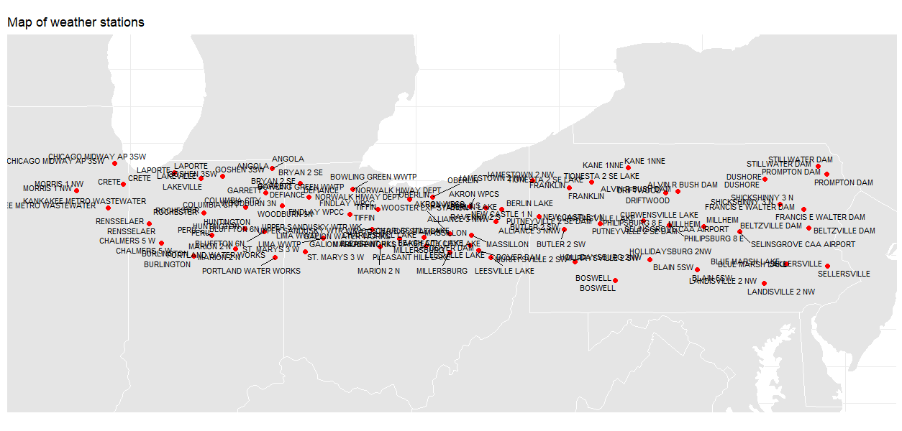
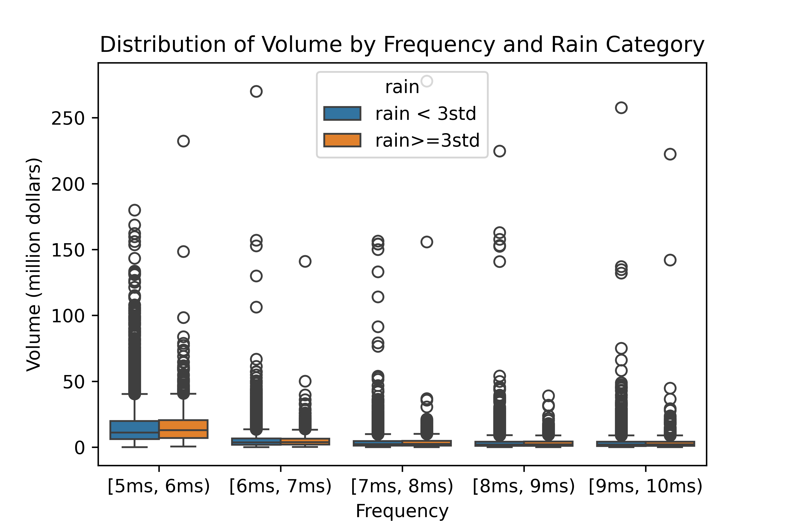
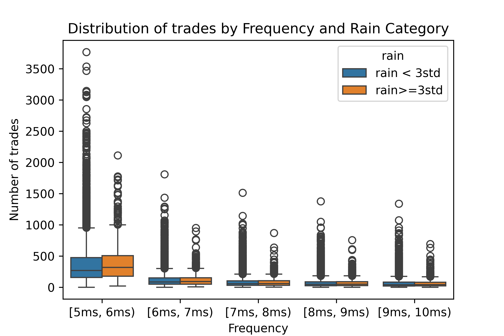

# Revisit: Latency Arbitrage under Different Weather Conditions

## Author

Richie Ma is a Ph.D. student who is drawn to research on financial market microstructure and high-frequency trading. He has a good sense of market microstructure in the U.S. stock, ETF, and futures markets. His recent research mainly focuses on microstructure in the CME futures markets, specifically market liquidity. He has experience on parsing CME market data, including both FIX and binary protocols, reconstructing limit order book, and analyzing big data in both Python and R languages. He is a member of Bielfeldt Office for Futures and Options Research and currently a teaching assistant at Department of Industrial & Enterprise Systems Engineering at the University of Illinois. 

His technical skill set includes proficiency in financial market microstructure, R, and Python. He co-authored an R package `cme.mdp` with Brian Peterson and he is also creating similar packages in Python.
- **Email**: [ruchuan2@illinois.edu](mailto:ruchuan2@illinois.edu)
- **Personal website**: [https://www.richiema.com/](https://www.richiema.com/)

## Introduction

Latency arbitrage is one of the most popular ultra-low latency strategies in the high-frequency trading industry and literature has suggested that this strategy can indeed make great profits. During the last decade, some high-frequency trading firms may use the microwave to implement latency arbitrage instead of fiber optic cables to become slightly faster than other market participants. However, since the microwave is more prone to weather disruption, especially during the heavy raining period. This project uses some recent data, from August 2018 to December 2019 to assess latency arbitrage between CME E-mini S&P 500 futures and SPDR S&P 500 ETF (SPY).

HFTs are a subset of algorithmic trading (AT) firms made possible by electronic trading. ATs use computer algorithms to execute trading decisions with minimal human intervention. HFTs differ from other ATs given their substantial investment in financial technologies that enhance the speed of order placement in response to new market information. This enables HFTs to capitalize on strategies that leverage differences in reaction times. Investments in progressively faster telecommunication systems between the CME and the NY cluster have been massive. In 2010, a high-speed fiber optic cable connecting the two markets was completed. However, in September of the same year, trading firms started soliciting permission from the Federal Communications Commission (FCC) to build microwave transmission routes along the same corridor. Compared to fiber optic cables, microwaves transmit information about 2 milliseconds faster, yet they are vulnerable to disruptions due to rainfall and snow and offer a more limited bandwidth. Using FCC records, literature document that by September 2012 fifteen microwave registered networks were operating between Chicago and New York using 6, 11, and 18 GHz bands. As of July 2023, FCC records showed eight licensed transmission towers using 6, 11, 18, and 22 GHz bands placed on top or near the CME data center in Aurora, Illinois. While the microwave networks have improved both their speed and capacity over time, they have been unable to eclipse fiber optics in terms of reliability and capacity.

## Data
In this section I detail my data sources. I use four data sources that offer precipitation and market data for the period from 2018 to 2019, the National Oceanic and Atmospheric Administration (NOAA), the New York Stock Exchange (NYSE) Daily Trade and Quote (DTAQ) data, the CME Market by Price data, and Bloomberg.   

### Weather data
From NOAA we obtain precipitation data to identify periods when precipitation may have disrupted microwave transmission. The U.S. 15-Minute Precipitation Data, archived by NOAA’s National Centers for Environmental Information, comprises measurements from approximately 2,000 weather stations across the United States. The dataset includes precipitation rates from Fisher & Porter gauges, which record precipitation in increments as small as one-hundredth of an inch and are timestamped at 15-minute intervals.

The National Centers for Environmental Information (NCEI) (previously known as the National Climatic Data Center (NCDC) which dissolved in 2015) are operated in part by an office of the National Oceanographic and Atmospheric Administration (NOAA). The NCDC data set 3260 (DSI-3260) also known as the 15 Minute Precipitation Data is available from 1971 through 2013. Since geo-location station data is not found for this period, I use the geo-location station data in NCEI’s 2014 and onwards Hourly Precipitation Data set (HPDv2 beta version). I focus on 2018-2019 data from the DSI-32604 and the HPDv2 beta version5 that provides 15-minute precipitation intervals. The raw data have some unreasonable values (e.g., negative precipitation), and I correct these observations with 0. I intersect the HDPv2 station data with the the 2011-2013 DSI-3260 station data to obtain a list of weather stations operating in Illinois, Indiana, Michigan, Ohio, Pennsylvania, and New Jersey for 2018-2019. The HPDv2 beta version readme file states precipitation data is in hundredths of an inch. My station list is as follows:

| Station ID    | Latitude | Longitude | State | Name                        |
|---------------|----------|-----------|-------|-----------------------------|
| USC00111577   | 41.7372  | -87.7775  | IL    | CHICAGO MIDWAY AP 3SW      |
| USC00112011   | 41.4492  | -87.6221  | IL    | CRETE                       |
| USC00114603   | 41.1351  | -87.8856  | IL    | KANKAKEE METRO WASTEWATER  |
| USC00115825   | 41.3708  | -88.4336  | IL    | MORRIS 1 NW                |
| USC00120200   | 41.6639  | -85.0183  | IN    | ANGOLA                     |
| USC00120830   | 40.8143  | -85.1546  | IN    | BLUFFTON 6N                |
| USC00121147   | 40.4835  | -86.3961  | IN    | BURLINGTON                 |
| USC00121417   | 40.6653  | -86.9550  | IN    | CHALMERS 5 W               |
| USC00121739   | 41.1452  | -85.4898  | IN    | COLUMBIA CITY              |
| USC00123206   | 41.3415  | -85.1292  | IN    | GARRETT                    |
| USC00123418   | 41.5575  | -85.8825  | IN    | GOSHEN 3SW                 |
| USC00124181   | 40.8555  | -85.4980  | IN    | HUNTINGTON                 |
| USC00124782   | 41.5269  | -86.2692  | IN    | LAKEVILLE                  |
| USC00124837   | 41.6116  | -86.7297  | IN    | LAPORTE                    |
| USC00125337   | 40.5800  | -85.6586  | IN    | MARION 2 N                 |
| USC00126864   | 40.7646  | -86.0740  | IN    | PERU                       |
| USC00127069   | 40.4667  | -84.9667  | IN    | PORTLAND WATER WORKS      |
| USC00127298   | 40.9239  | -87.1754  | IN    | RENSSELAER                 |
| USC00127482   | 41.0665  | -86.2096  | IN    | ROCHESTER                  |
| USC00129724   | 41.1645  | -84.8482  | IN    | WOODBURN 3N                |
| USC00330059   | 41.1573  | -81.5664  | OH    | AKRON WPCS                 |
| USC00330107   | 40.9551  | -81.1167  | OH    | ALLIANCE 3 NNW             |
| USC00330493   | 40.6335  | -81.5577  | OH    | BEACH CITY LAKE           |
| USC00330639   | 41.1169  | -81.0094  | OH    | BERLIN LAKE               |
| USC00330862   | 41.3831  | -83.6111  | OH    | BOWLING GREEN WWTP        |
| USC00331042   | 41.4619  | -84.5272  | OH    | BRYAN 2 SE                |
| USC00331466   | 40.7333  | -82.3667  | OH    | CHARLES MILL LAKE         |
| USC00332098   | 41.2783  | -84.3847  | OH    | DEFIANCE                  |
| USC00332272   | 40.5622  | -81.4092  | OH    | DOVER DAM                 |
| USC00332791   | 41.0461  | -83.6622  | OH    | FINDLAY WPCC              |
| USC00333021   | 40.7231  | -82.7999  | OH    | GALION WATER WORKS        |
| USC00334473   | 40.4709  | -81.1955  | OH    | LEESVILLE LAKE            |
| USC00334551   | 40.7247  | -84.1294  | OH    | LIMA WWTP                 |
| USC00334942   | 40.6142  | -83.1300  | OH    | MARION 2 N                |
| USC00334992   | 40.7667  | -81.5333  | OH    | MASSILLON                 |
| USC00335297   | 40.5375  | -81.9197  | OH    | MILLERSBURG               |
| USC00336123   | 41.2500  | -82.6167  | OH    | NORWALK HIWAY DEPT        |
| USC00336196   | 41.2802  | -82.2187  | OH    | OBERLIN                   |
| USC00336702   | 40.6245  | -82.3271  | OH    | PLEASANT HILL LAKE        |
| USC00336949   | 41.1366  | -81.2844  | OH    | RAVENNA 2 S               |
| USC00337383   | 40.5449  | -84.4374  | OH    | ST. MARYS 3 W             |
| USC00338313   | 41.1167  | -83.1667  | OH    | TIFFIN                    |
| USC00338539   | 40.8428  | -83.2767  | OH    | UPPER SANDUSKY WTR WK     |
| USC00339312   | 40.7833  | -81.9167  | OH    | WOOSTER EXP STATION       |
| USC00360147   | 41.3579  | -77.9264  | PA    | ALVIN R BUSH DAM          |
| USC00360560   | 40.8620  | -75.6429  | PA    | BELTZVILLE DAM            |
| USC00360725   | 40.3027  | -77.5894  | PA    | BLAIN 5SW                 |
| USC00360785   | 40.3803  | -76.0275  | PA    | BLUE MARSH LAKE           |
| USC00360821   | 40.1597  | -79.0287  | PA    | BOSWELL                   |
| USC00361139   | 40.8415  | -79.9163  | PA    | BUTLER 2 SW               |
| USC00361961   | 40.9583  | -78.5294  | PA    | CURWENSVILLE LAKE         |
| USC00362245   | 41.3421  | -78.1401  | PA    | DRIFTWOOD                 |
| USC00362323   | 41.5216  | -76.4043  | PA    | DUSHORE                   |
| USC00363018   | 41.1184  | -75.7277  | PA    | FRANCIS E WALTER DAM      |
| USC00363028   | 41.4004  | -79.8305  | PA    | FRANKLIN                  |
| USC00364001   | 40.4388  | -78.4173  | PA    | HOLLIDAYSBURG 2NW         |
| USC00364325   | 41.4992  | -80.4681  | PA    | JAMESTOWN 2 NW            |
| USC00364432   | 41.6770  | -78.8036  | PA    | KANE 1NNE                 |
| USC00364778   | 40.1190  | -76.4265  | PA    | LANDISVILLE 2 NW          |
| USC00365790   | 40.8847  | -77.4750  | PA    | MILLHEIM                  |
| USC00366111   | 40.4120  | -79.7245  | PA    | MURRYSVILLE 2 SW          |
| USC00366233   | 41.0172  | -80.3615  | PA    | NEW CASTLE 1 N            |
| USC00366916   | 40.9017  | -78.0842  | PA    | PHILIPSBURG 8 E           |
| USC00367186   | 41.5890  | -75.3303  | PA    | PROMPTON DAM              |
| USC00367229   | 40.9248  | -79.2825  | PA    | PUTNEYVILLE 2 SE DAM      |
| USC00367931   | 40.8153  | -76.8556  | PA    | SELINSGROVE CAA AIRPORT   |
| USC00367938   | 40.3552  | -75.3131  | PA    | SELLERSVILLE              |
| USC00368057   | 41.1831  | -76.1488  | PA    | SHICKSHINNY 3 N           |
| USC00368491   | 41.6972  | -75.4827  | PA    | STILLWATER DAM            |
| USC00368873   | 41.4792  | -79.4432  | PA    | TIONESTA 2 SE LAKE        |

Here, I show a summary statistics of the precipitation during the whole sample period. Obviously, one can find that for each weather station across the whole sample period, the average precipitation is just 0.08 inches and the largest precipitation is 3.1 inches. Thus, we could know that the microwave disruption is just a rare case and for most of trading days, the latency arbitrage is not likely to be affected by the weather.
|       |   precipitation |
|-------|-----------------|
| count |    9990         |
| mean  |       0.0791802 |
| std   |       0.178167  |
| min   |       0         |
| 25%   |       0         |
| 50%   |       0.01      |
| 75%   |       0.06      |
| max   |       3.1       |

## Market Data  

The NYSE DTAQ reports intraday trade and quote data for all market activity within the U.S. National Market System. It provides tick-by-tick trade prices and volumes, and top-of-book market data timestamped to the millisecond for each market and exchange. It also reports the National Best Bid and Offer (NBBO), reflecting the highest bid and lowest ask prices for each security across all exchanges at a specific time, and the consolidated trade file that aggregates trades from all exchanges. I use the NBBO and consolidated trades to assess market quality for our sample of securities. 

In terms of futures data, I use the CME Market by Price (MBP) data provided by CME Datamine and I select the most-traded futures contracts according to the daily trading volume. It contains all trades and quote updates up to 10 depths. For SPY data, I use the Daily Trade and Quote (TAQ) data. Specifically, I focus on the Millisecond Trades and NBBO data. Since the CME futures is traded during 18:00 to 17:00 ET while the ETF is traded during 9:30 to 16:00 ET, I concentrate regular trading hours from 9:30 to 16:00 ET. I find almost all trades are assigned the direction (e.g., buyer-initiated/seller-initiated) directly by the CME while no trade direction is assigned in the ETF by the data. Hence, I follow Lee and Ready (1991) to assign its trade direction, including both quote test and tick test. 

Since the CME MBP data records every update quotes instead of providing a limit order book directly, I reconstruct the limit order book according to the quote update data. In terms of the ETF data, the NBBO data records the best-bid-offer prices and quotes among all trading venues. One needs to know that the NBBO data only records the round-lot, i.e., >=100 shares. Thus, I need to multiply the displayed quantity by 100.

## Market liquidity and precipitation
Market liquidity is likely to be affected by the precipitation with the importance of communication increasing. Market makers may reduce their liquidity provision during heavy precipitation period, because of both communication delay and picking off risks. Thus, I first assess how the precipitation affects the market liquidity during the heavy precipitation. Here, I focus on the following liquidity indicators, including the bid-ask spread expressed in basis (dollar spread over the midpoint price), BBO dollar depths and non-BBO depths, both express expressed in millions, dollar trading volume. I select the volatility as control variables. Since the weather data is in 15-min interval, I calculate the time-weighted indicators for every 15 minutes. I calculate the indicators for both futures and ETF markets.

### Summary statistics of market liquidity
I show the summary statistics of the market liquidity across the whole sample period as follows. 
|       |   spread_emini |   BBO_emini |   Non_BBO_emini |   volatility_emini |   vol_emini |   #trades_emini |  
|-------|----------------|-------------|-----------------|--------------------|-------------|-----------------|
| count |        9004    |     9004    |         9004    |            9004    |     9004    |         9004    | 
| mean  |           0.88 |       37.27 |          434.64 |               1.25 |     6278.91 |         6920.47 |
| std   |           0.05 |       18.88 |          170.45 |               0.99 |     4686.41 |         5699.85 |  
| min   |           0.77 |        3.23 |           66.95 |               0.12 |      673.24 |          573    |
| 25%   |           0.84 |       22.39 |          305.03 |               0.6  |     3042.31 |         2973    |
| 50%   |           0.87 |       35.55 |          417.08 |               0.96 |     4874.92 |         5106.5  |
| 75%   |           0.9  |       49.7  |          541.44 |               1.57 |     8031.21 |         9051.75 |
| max   |           1.17 |      137.98 |         1267.64 |              10.3  |    52576.6  |        65976    |

|       |   spread_spy |   BBO_spy |   volatility_spy |   vol_spy |   #trades_spy |
|-------|--------------|-----------|------------------|-----------|---------------|
| count |      9004    |   9004    |          9004    |   9004    |        9004   |
| mean  |         0.57 |      0.83 |             0.13 |    732.13 |       13769.5 |
| std   |         0.25 |      0.61 |             0.1  |    638.46 |       12010.5 |
| min   |         0.33 |      0.16 |             0.01 |     83.47 |        2103   |
| 25%   |         0.44 |      0.42 |             0.07 |    343.96 |        6544   |
| 50%   |         0.5  |      0.6  |             0.1  |    549.21 |        9990.5 |
| 75%   |         0.62 |      0.94 |             0.17 |    877.89 |       16678   |
| max   |         4.61 |      4.3  |             1.32 |   9201.33 |      189976   |

### Regression
Since the goal of this project is to know whether heavy precipitation disrupts the market liquidity, hence, I do not focus on the magnitude of precipitation. To represent the heavy precipitation, I first calculate the total precipitation for all weather stations, and I create a dummy (binary) variable `rain`, which equals 1 if a precipitation of a 15-min interval is greater than the 2 times standard deviation of the daily precipitation, and 0 otherwise. Here are the results for the CME E-mini futures:

| Bid-ask spread    | coef  | std err | t       | P>\|t\| | BBO depth         | coef   | std err | t       | P>\|t\| |
| ----------------- | ----- | ------- | ------- | ------- | ----------------- | ------ | ------- | ------- | ------- |
| const             | 0.845 | 0.001   | 1010.28 | 0       | const             | 49.999 | 0.288   | 173.695 | 0       |
| rain              | 0.003 | 0.001   | 2.886   | 0.004   | rain              | -1.181 | 0.414   | -2.854  | 0.004   |
| volatility\_emini | 0.026 | 0       | 52.511  | 0       | volatility\_emini | -9.964 | 0.172   | -57.943 | 0       |

| Non-BBO depth     | coef    | std err | t       | P>\|t\| | Trading vol       | coef    | std err | t      | P>\|t\| |
| ----------------- | ------- | ------- | ------- | ------- | ----------------- | ------- | ------- | ------ | ------- |
| const             | 548.152 | 2.619   | 209.308 | 0       | const             | 2368.7  | 63.367  | 37.381 | 0       |
| rain              | -16.853 | 3.764   | -4.478  | 0       | rain              | 129.501 | 91.066  | 1.422  | 0.155   |
| volatility\_emini | -87.802 | 1.564   | -56.123 | 0       | volatility\_emini | 3101.79 | 37.854  | 81.941 | 0       |

We find that when the CME futures markets experiences the heavy precipitation, the bid-ask spread is expected to reduce 0.003 basis point significantly, compared to the less precipitation periods. For BBO depth, we find the BBO depth reduces by 1.181 million dollars compared to the regular trading periods significantly. Similar effect is also found to non-BBO depths where it is expected to reduce 16.85 million dollars significantly. However, we find the heavy rain does not have significant effects on the trading volume.

The following are results from the ETF. Since there is non-BBO information available from the TAQ data, our dependent variables only include bid-ask spread, BBO depth, and trading volume.

|Bid-ask spread   | coef  | std err | t       | P>\|t\| | BBO Depth       | coef   | std err | t       | P>\|t\| |
| --------------- | ----- | ------- | ------- | ------- | --------------- | ------ | ------- | ------- | ------- |
| const           | 0.401 | 0.004   | 103.352 | 0       | const           | 1.085  | 0.010   | 103.493 | 0       |
| rain            | 0.013 | 0.005   | 2.327   | 0.02    | rain            | -0.044 | 0.015   | -3.002  | 0.003   |
| volatility\_spy | 1.261 | 0.022   | 57.403  | 0       | volatility\_spy | -1.856 | 0.059   | -31.256 | 0       |

|Trading volume   | coef    | std err | t      | P>\|t\| |
| --------------- | ------- | ------- | ------ | ------- |
| const           | 225.808 | 9.221   | 24.489 | 0       |
| rain            | -3.943  | 13.019  | -0.303 | 0.762   |
| volatility\_spy | 3791.8  | 52.221  | 72.611 | 0       |

Similarly to what I find for the CME E-mini S&P 500 futures market, during the heavy rain period, the bid-ask spread in the SPY is expected to reduce by 0.013 bps, and the effect is statistically significant at 5%. The BBO depth is expected to reduce by 0.044 million dollars and its effect is statistically significant at 1%. The trading volume is expected to decrease by 3.94 million dollars while the decrease effect is not statistically significant at 1%. 

This result indicates a possible pattern of latency arbitrage. When it rains heavily, the market makers are likely to reduce the liquidity provision in the SPY market to avoid the picking off risks, which could be seen from the results for bid-ask spread and BBO depth. However, the heavy precipitation does not eliminate the latency arbitrage, suggesting by the trading volume.

## Latency arbitrage under heavy precipitation

I examine microwave transmissions from HFTs involved in spatial latency arbitrage. The analysis focuses on observing potential trade delays resulting from HFTs switching between microwave networks and fiber optic cable transmissions due to precipitation. Empirically, microwave transmissions typically take between 4.5 to 5 milliseconds, whereas fiber optic transmissions require approximately 6.5 to 8 milliseconds, resulting in a difference of 2 to 3 milliseconds. If HFTs fail to automatically switch to fiber optics, information transmission may still occur, albeit with potential loss, necessitating correction algorithms that could introduce additional delays of around 2 to 4 milliseconds. We attempt to detect differences in trading behavior during precipitation vs. non-precipitation periods within a single trading day. Since the light travels from Chicago to New York in about 5 milliseconds, thus, I do not analyze the latency arbitrage under 5 milliseconds as it violates the speed of light.

I identify HTF futures market signals that HFTs can arbitrage in the NY cluster employing two criteria to capture meaningful trading patterns. First, I identify “standalone signals” as trades in the futures market separated by at least 10 milliseconds from the previous trade, which helps isolate independent trading decisions rather than split orders. Second, I capture trades that represent a change in price direction. The direction of each trade is determined using the Lee and Ready (1991) algorithm. By requiring either time separation or direction changes, I aim to capture genuine HFT activity while filtering out noise from regular trading patterns, thus helping to distinguish deliberate HFT strategies from regular market activity or order splitting. After identifying these signals, I analyze their impact by counting the number of trades in the counterpart ETF market in subsequent 1-millisecond intervals. To conduct the analysis I use market depth data from the CME that includes trade and quote information time stamped to the millisecond. I observe trade activity in the NY cluster securities within 5 to 10 milliseconds after the selected futures market signals. Given current technology speeds, the minimum time to observe HFT responses is 4.5 milliseconds. Further, I cannot be certain that trade activity beyond 10 milliseconds originates from the HFTs focused on spatial latency.

Identifying HFT is challenging since their behavior might manifest in various ways depending on the intensity of their activities. Similar to the analyses I created before, I create a dummy variable that equals 1 if a precipitation of a 15-min interval is greater than the 3 times standard deviation of the daily precipitation, and 0 otherwise. We focus on the trading volume and the total number of trades during the following millisecond intervals: [5ms, 6ms), [6ms, 7ms), [7ms, 8ms), [8ms, 9ms), [9ms, 10ms). The following figure shows the result for the total trading volume in the SPY ETF.

It is obvious that regardless of it is in a heavy precipitation period, the latency arbitrage concentrates between 5 milliseconds and 6 milliseconds, and the intensity of latency arbitrage gradually reduces with the time going on. That is consistent to the intuition that the latency arbitrage heavily relies on the speed advantage and ultra-low latency traders are more likely to earn profits. During the heavy precipitation period, the trading volume between the 5 milliseconds and 6 milliseconds decreases though the median would remain almost the same. However, there are fewer observations with high trading volume like in regular trading periods. This is also true for other millisecond bins.

The following figure shows the result for the total number of trades:

This result is more obvious that for the trading volume. One can find that during the heavy precipitation period, the number of trades reduces clearly though the box remains almost the same. During the millisecond bin [5ms, 6ms), one can easily find the maximum number of trades is around 2000 during the heavy precipitation, while this number is more than 3500 during the regular trading hours. Similar pattern can be also found for other millisecond bins.

## Concluding remarks and future improvements
This project analyses the latency arbitrage and weather and the conclusions can be summarized as follows:

1) The weather condition helps explain the market liquidity and heavy precipitation reduces the market liquidity, suggesting by wider bid-ask spread, less depths in the book.
2) The intensity of latency arbitrage reduces during the heavy precipitation, suggesting by the number of trades and trading volume, while the millisecond bin distribution still shows that the latency arbitrage concentrates on the [5ms, 6ms).

A key limitation of this project is the absence of regulatory or account-level data to directly identify HFTs. As a result, we rely on precipitation disruptions as a proxy for HFT speed advantages. This limitation constrains our ability to attribute observed market dynamics exclusively to HFT activity. Future projects could use regulatory data from both futures and securities markets to precisely identify HFTs and better estimate their effects on market liquidity.
